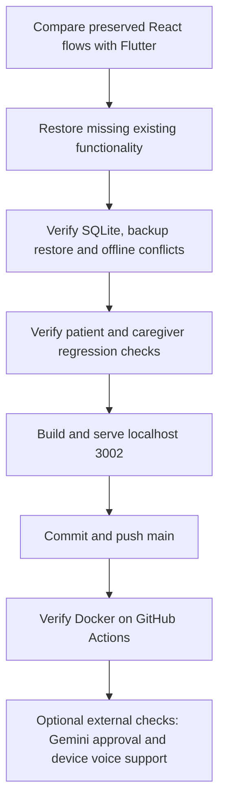

# Memory Mate functional parity — 15 September 2026

Scope: complete the existing application against the preserved React version. No new product features. Design/Figma accessories and GKE deployment are excluded.

| Existing capability | Older React version | Current Flutter / FastAPI version | Evidence |
|---|---|---|---|
| Patient and caregiver modes | Separate views | Restored separate views, shared patient selection | Browser parity suite |
| Caregiver dashboard | Summary, reminders, history and trends | Restored summary, schedule, recorded history and weekly chart | Browser dashboard checks; chart source reviewed |
| Extended patient profile | Caregiver, ASHA, hospital and condition notes | Persisted in SQLite; editable | Backend CRUD tests, profile browser checks |
| Patient records | Browser-local records | 103 fictional seeded profiles; isolated SQLite records | API checks and persistence tests |
| Reminders | Patient completion and caregiver editing | Shared CRUD, notes, assignment and completion | Browser persistence and isolation checks |
| Memory box | Photo URLs, captions, reading and optional AI prompt | Restored CRUD, reading and optional prompt route | Memory editing browser test; voice requires device support |
| Family photos and assistant | Supplied labels, chat/photo/voice helpers | Restored labels, chat/photo input and saved-data fallback | Browser labels and fallback checks; live AI pending approval |
| Three games | Word, pattern, matching | All three save measured counts, accuracy and response time | Browser game checks, zero-score regression |
| Assessment | Synthetic-trained logistic regression | Explicit deterministic profile-based rules, intentionally replacing regression | Backend assessment tests; see REVIEWER_CHECKLIST.md |
| Older activity history | Session rows and legacy labels | Imported rows remain visible separately; excluded from native recorded trends | Source comparison; backend backup preservation tests |
| Offline operation | Browser persistence and queued feedback | Cached app shell, profile cache and durable CRUD/activity queue | Real network-off reload browser test |
| Retry and conflict handling | Queued updates | Stable operation receipts, duplicate prevention and explicit conflict choice | Backend receipt tests; browser parity suite |
| Export and restore | Profile/all exports and backup import | Profile/all exports, full JSON backup, validated merge restore and recovery copy | Backend restore tests; actual browser download/file-picker restore |
| Local PIN | Browser access gate | Salted local PIN gate, unlock and lock | Browser PIN checks; not server authentication |
| Languages | English, Hindi, Assamese | Existing flows and restored controls translated | Flutter localization tests; Hindi/Assamese browser checks |
| Install/offline shell | PWA affordance | Install prompt or browser instructions; cached Flutter shell | Network-off shell test; install UI depends on browser |
| Containers | Existing deployment support | Flutter/Nginx plus FastAPI and persistent SQLite volume | GitHub Verify Docker demo workflow |

## Verification commands

- Backend: `python -m unittest discover -s tests -v` from `backend` — 9 tests.
- Flutter: `flutter analyze`, `flutter test`, release web build — 4 tests and clean analysis.
- Browser scripts: `browser-flutter.mjs`, `browser-reviewer.mjs`, `browser-parity.mjs`, `browser-offline.mjs` under `scripts`.
- Browser tests use frontend port 3002 and an isolated test API on port 8003, with Gemini disabled. Set `PLAYWRIGHT_MODULE` and `BROWSER_EXECUTABLE` for the installed runtime/browser.

## Boundaries that remain

Live Gemini service verification awaits explicit permission to send fictional activity metrics and reminder counts. Key configuration alone does not prove a successful provider response. Microphone, speech voices and the installation prompt depend on the user's browser/device and have not been verified with their hardware. Translation key coverage is tested; native-speaker editorial review is not done.

Original browser records are not silently imported: use the older version's backup export and the current restore flow. Imported legacy sessions are preserved without pretending that missing raw game measurements can be reconstructed. The PIN is a local browser gate; public hosting/server authentication are outside this local-demo task.

Do not count excluded design work or GKE as unfinished functional parity. Do not call the live AI or device-dependent checks verified merely because their code exists.
