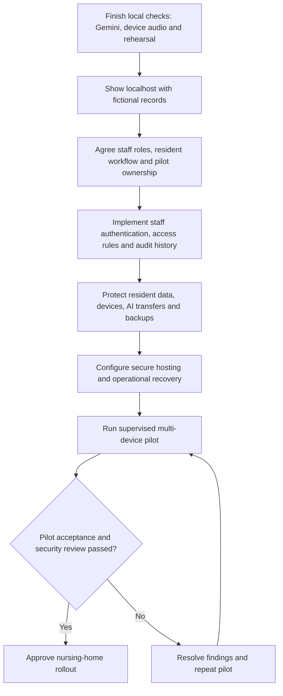

# Pending work: localhost demonstration to nursing-home pilot

Updated 15 September 2026. Intended setting confirmed by owner: India, multiple staff devices. This is a staged delivery plan, not a claim that the prototype is ready for resident data. Design accessories and GKE remain excluded.

## Stage 1 — prototype closeout

| Item | Current evidence | Remaining action |
|---|---|---|
| Existing functional regression | Backend, Flutter, browser and Docker tests passed; see FEATURE_PARITY.md | Rehearse on the presentation laptop |
| Fresh backup | Consistent SQLite backup created on 15 September; integrity check passed; 103 profiles | Keep the ignored local backup available for the presentation; do not commit data |
| Live Gemini | Owner approved fictional metrics only. Model-list request returned 200 and listed configured gemini-3.8-flash. Generation timed out once, then provider returned 503 | Retry when provider recovers; show saved-record fallback meanwhile. Successful model listing does not prove generation works |
| Browser capabilities | Headless Chrome reported secure context, speech recognition/synthesis and service-worker APIs; no voices enumerated | Check audible playback, chosen language voice and microphone on the actual laptop. API presence is not a hardware test |
| Install | Offline shell previously passed a real network-off test | Verify install affordance manually in the chosen presentation browser |

Suggested rehearsal: open localhost:3002, unlock, select a fictional profile, show caregiver schedule, switch to patient view, play a game, return to recorded history and explain the deterministic rule. Show the AI fallback honestly if generation remains unavailable. Demonstrate backup download and explain restore; avoid replacing the main database just for rehearsal.

## Stage 2 — required before a real-resident multi-device pilot

These are pending implementation/acceptance tasks, not already delivered features.

| Priority | Work | Source evidence / acceptance criterion |
|---|---|---|
| P0 | Individual staff accounts, session expiry, recovery and revocation | Current pin_gate.dart is a local browser gate. API must reject unauthenticated requests even when called directly |
| P0 | Server-enforced resident/facility permissions | app.py and parity.py expose patient reads, edits, exports and restore without user authorization. Test a staff member cannot access another facility or unassigned resident by changing IDs |
| P0 | Restrict offline resident caches and protect shared/lost devices | api_service.dart prefetches /api/offline; current endpoint returns all profiles. Cache only authorized records, enforce logout/expiry behavior and decide whether offline access is allowed on unmanaged devices |
| P0 | Audit changes, exports, restores and access administration | Mutation receipts prevent duplicates but are not a staff audit trail. Record actor, resident, operation and time with restricted audit access; avoid logging secrets or unnecessary clinical text |
| P0 | Resident-data governance and AI transfer controls | Define notice, lawful processing/consent where applicable, authorized-representative process, retention, deletion and grievance/incident ownership with the nursing home. Gemini assistant currently includes saved profile, reminders and memory text; real-data use requires review and explicit controls |
| P0 | Secure service deployment and secrets | Current compose.yaml intentionally publishes loopback HTTP only. Before external access, configure HTTPS, authenticated access, secrets management, patching and monitoring; do not simply expose port 3002 |
| P0 | Protected backups and recovery drill | Current JSON exports and SQLite copies are unencrypted. Define authorized exports, encrypted backup storage, key handling, retention, off-device recovery and restore objectives. Prove restore into an isolated environment |
| P1 | Concurrent multi-device and failure tests | Existing version conflicts and idempotency are a foundation. Test simultaneous staff edits, network loss, expired sessions, revoked access and service restarts under realistic pilot load |
| P1 | Staff usability, language and accessibility review | Have staff test real workflow with fictional records first. Verify Hindi/Assamese wording, large text, touch targets, browser audio and shared-device handover |
| P1 | Data and rule acceptance | Confirm measured counts, timestamps, reminder ownership and missing-data behavior. Assess deterministic outputs as non-diagnostic activity summaries. Do not present support bands as dementia severity or use them to determine treatment |
| P1 | Supervised pilot and operational owner | Agree pilot size/duration, support contact, rollback plan, issue reporting and success criteria. Obtain nursing-home acceptance and independent security/privacy review before rollout |

SQLite is not automatically disqualified by multiple devices: clients should use the central API, never share a database file directly. Evaluate storage changes against actual concurrency, backup and availability requirements after the pilot workload is defined.

## Provider and India review inputs

- [Google Gemini API terms](https://ai.google.dev/gemini-api/terms), checked 15 September 2026: unpaid services must not receive sensitive, confidential or personal information. Paid-service data handling differs, but payment alone does not remove clinical-use restrictions. Confirm the proposed non-clinical workflow is permitted; keep AI optional pending that review.
- [MeitY DPDP Rules 2025 and enforcement timeline](https://www.meity.gov.in/documents/act-and-policies/digital-personal-data-protection-rules-2025-gDOxUjMtQWa?pageTitle=Digit): have the nursing home's responsible privacy/legal owner determine applicable obligations and commencement dates for the actual launch. This checklist does not certify legal compliance.

No real resident data was sent in the checks for this plan. No deployment, billing change, production authentication migration or GKE resource was created.
